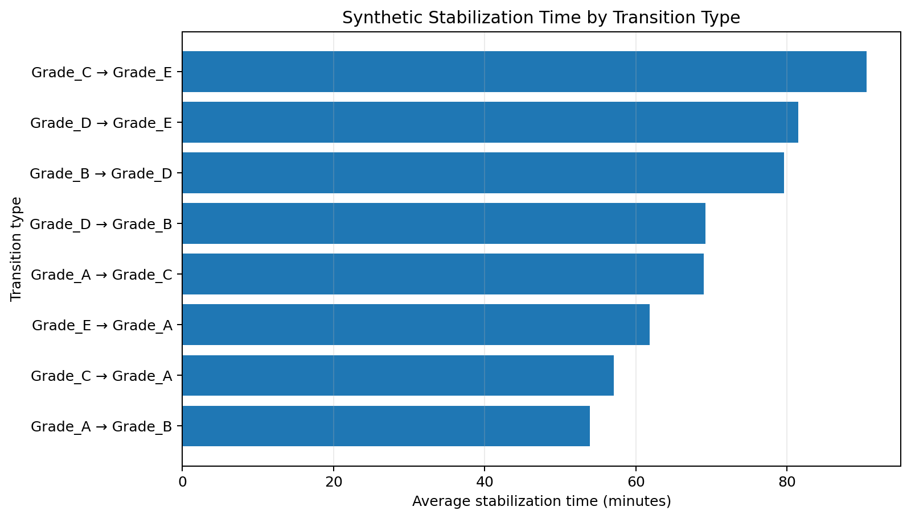
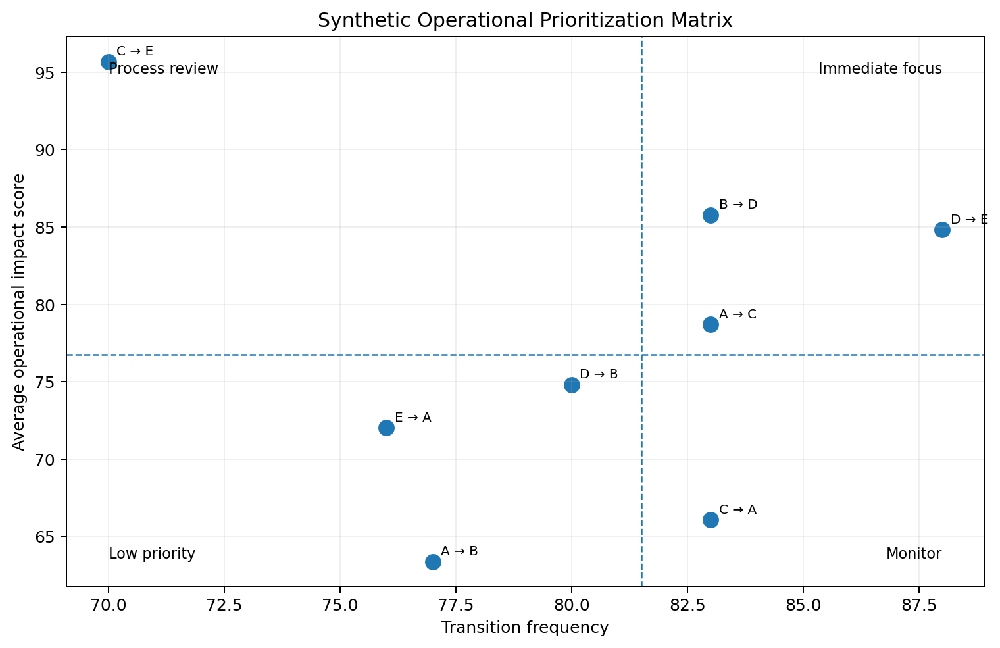
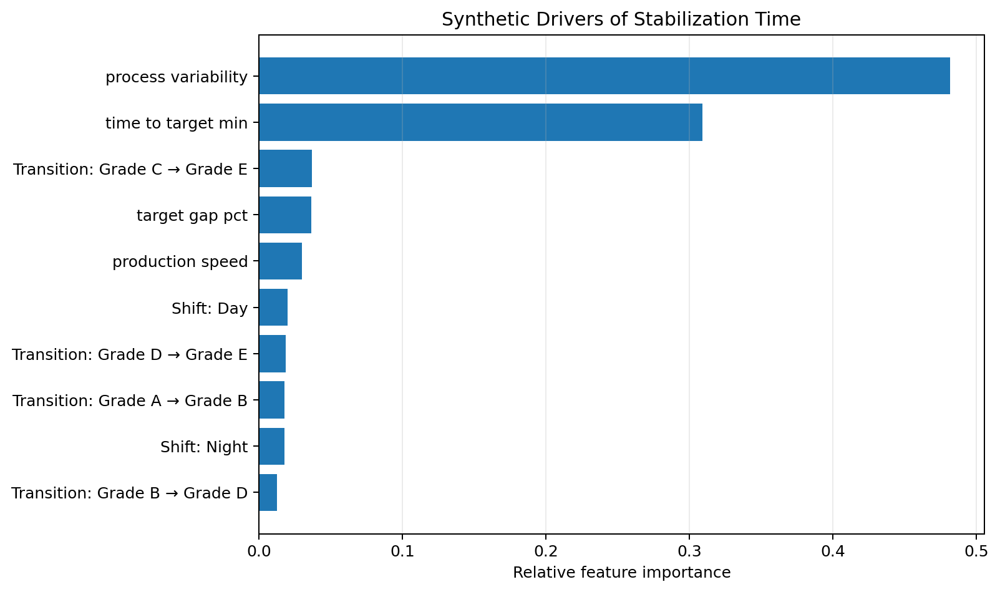

# Manufacturing Transition Stability Analysis

## Overview

Manufacturing processes often experience temporary performance loss when switching between product grades or operating configurations. Reaching a new production target does not necessarily mean that the process has fully stabilized.

This project demonstrates an analytical framework for measuring transition performance, identifying factors associated with longer stabilization periods, and prioritizing transition types for operational review.

This repository is a public technical demonstration inspired by analytical work completed during my Duke University MQM Capstone. All data used here is synthetic and does not contain proprietary client information or actual project findings.

## Business Problem

Traditional transition metrics may focus primarily on how quickly a process reaches its new target. However, a process can reach the target while continuing to experience significant variability.

The analysis therefore considers two dimensions:

* Target achievement
* Process stability after the transition

The objective is to identify transitions that create the greatest operational risk and determine which process characteristics may help explain performance.

## Analytical Approach

### 1. Data Preparation

* Clean and validate transition-level manufacturing data
* Create transition labels
* Engineer operational and timing features
* Calculate measures of process variability

### 2. Stability Measurement

Develop a framework to distinguish between reaching the production target and achieving sustained process stability.

### 3. Transition Analysis

Compare transition types based on:

* Transition frequency
* Stabilization time
* Process variability
* Relative operational impact

### 4. Predictive Modeling

Use machine-learning methods to investigate factors associated with transition performance.

Methods demonstrated:

* Random Forest Regression
* Feature Importance Analysis
* Model evaluation using MAE and R²

### 5. Operational Prioritization

Combine transition frequency and relative impact into a prioritization framework to identify which transition types should receive operational attention first.

## Example Insights

Using synthetic data, the analysis demonstrates how:

* Reaching a production target quickly does not always indicate process stability.
* Certain transition types can contribute disproportionately to operational loss.
* Process settings and operating conditions can influence transition performance.
* Frequency and impact can be combined to prioritize process-improvement opportunities.

## Example Outputs

### Stabilization Time by Transition Type

This visualization compares average stabilization time across synthetic manufacturing transition types.

### Operational Prioritization Matrix

This matrix combines transition frequency and operational impact to demonstrate how transition types can be prioritized for operational review.

### Drivers of Stabilization Time

A machine-learning model is applied to the synthetic dataset to explore which transition and operating characteristics are most associated with stabilization time.

## Tools

**Python | Pandas | NumPy | Scikit-learn | Matplotlib**

**Analytical Methods:** Feature Engineering | Random Forest Regression | Feature Importance Analysis | Predictive Modeling | Operational Prioritization

## Business Value

The framework demonstrates how manufacturing transition data can be converted into actionable operational insights by helping teams:

* Separate target achievement from true process stability
* Compare transition performance consistently
* Investigate potential drivers of instability
* Identify higher-risk transition patterns
* Prioritize process-improvement opportunities using frequency and impact

## Confidentiality

This repository is a public technical demonstration inspired by analytical work completed during my Duke University MQM Capstone.

The original client work was conducted in a secure environment. All data and results presented in this repository are synthetic. No proprietary client data, original client code, confidential project details, actual project findings, or original deliverables are included.

